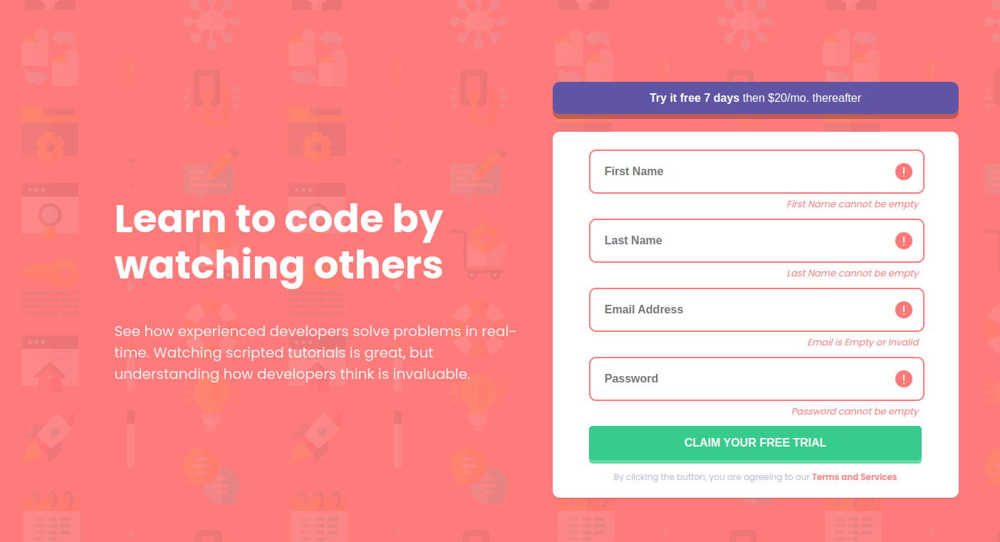

# Frontend Mentor - Intro component with sign up form solution

This is a solution to the [Intro component with sign up form challenge on Frontend Mentor](https://www.frontendmentor.io/challenges/intro-component-with-signup-form-5cf91bd49edda32581d28fd1). Frontend Mentor challenges help you improve your coding skills by building realistic projects.

## Table of contents

- [Overview](#overview)
  - [The challenge](#the-challenge)
  - [Screenshot](#screenshot)
  - [Links](#links)
- [My process](#my-process)
  - [Built with](#built-with)
  - [What I learned](#what-i-learned)
  - [Continued development](#continued-development)
- [Author](#author)
- [Acknowledgments](#acknowledgments)

## Overview

### The challenge

Users should be able to:

- View the optimal layout for the site depending on their device's screen size
- See hover states for all interactive elements on the page
- Receive an error message when the `form` is submitted if:
  - Any `input` field is empty. The message for this error should say *"[Field Name] cannot be empty"*
  - The email address is not formatted correctly (i.e. a correct email address should have this structure: `name@host.tld`). The message for this error should say *"Looks like this is not an email"*

### Screenshot

### Links

- Solution URL: [Github](https://github.com/MonarchRyuzaki/Interactive-Form)
- Live Site URL: [LIVE HERE!!](https://monarchryuzaki.github.io/Interactive-Form)

## My process

### Built with

- Semantic HTML5 markup
- CSS custom properties
- Flexbox
- Mobile-first workflow
- DOM Manipulation

### What I learned

I understood the workflow of form event and dealing with error messages. This was fun.

### Continued development

Get More Experience with DOM manipulation and in using JS

## Author

* LinkedIn - [Shivam Ganguly](https://www.linkedin.com/in/shivam-ganguly-357b90255/)
* Frontend Mentor - [@MonarchRyuzaki](https://www.frontendmentor.io/profile/MonarchRyuzaki)

## Acknowledgments

Special Thanks to [Colt Steele](https://www.udemy.com/user/coltsteele/) for his [Web Development Bootcamp](https://www.udemy.com/course/the-web-developer-bootcamp/).
